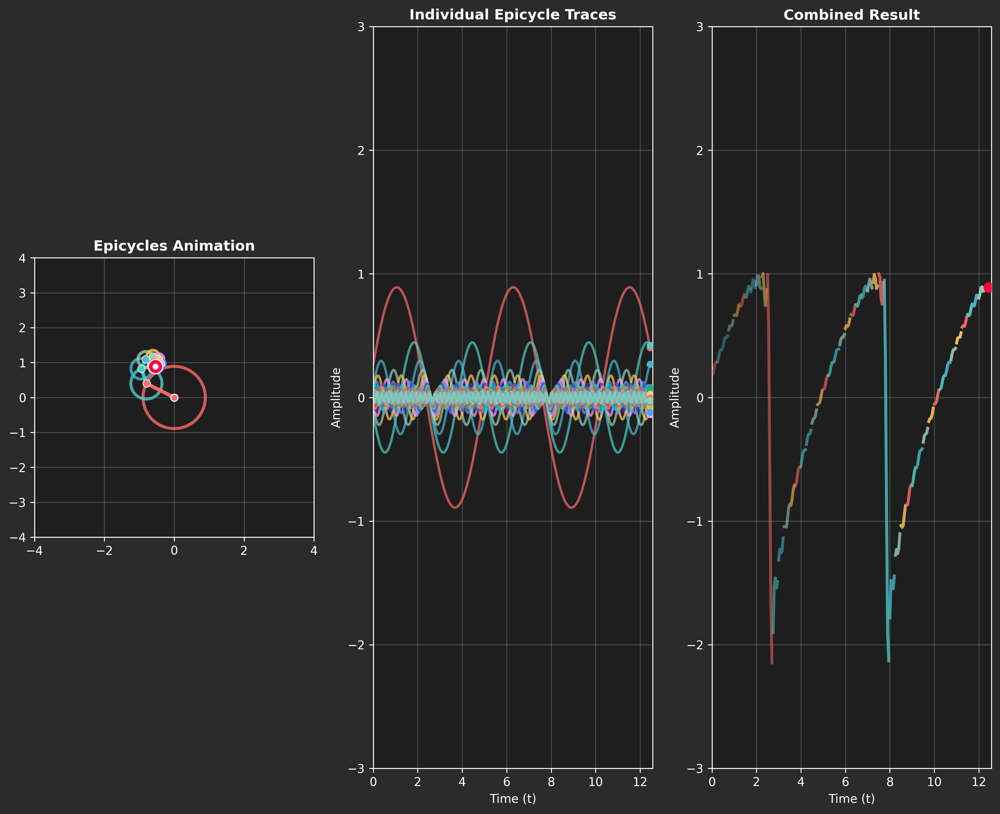

# 🎯 Mathematical Series Visualizer

[](https://python.org)
[](https://pypi.org/project/PyQt5/)
[](https://matplotlib.org/)
[](LICENSE)

An interactive Python application for visualizing mathematical series using animated rotating vectors (epicycles) and graphs. Perfect for education, research, and mathematical exploration!



## ✨ Features

### � Interactive Visualizations
- **Fourier Series**: Square wave, triangle wave, sawtooth wave with animated epicycles
- **Taylor Series**: Exponential, sine, and cosine function approximations
- **Parametric Curves**: Lissajous curves and epicycloids
- **Custom Equations**: Input your own mathematical functions

### 🎨 Advanced UI
- **Three-Panel Layout**: Epicycles animation, individual traces, combined result
- **Real-time Parameter Control**: Amplitude, frequency, phase adjustment
- **Multiple Themes**: Dark, light, colorful, rainbow, ocean, sunset
- **Formula Display**: Scientific notation with mathematical explanations

### 💾 Export Options
- **PNG Images**: High-quality static visualizations
- **GIF Animations**: Smooth animated exports
- **Future**: Video (MP4) and data (CSV/JSON) export planned

### 🔧 Technical Features
- **Modular Architecture**: JSON-based concept configuration
- **Performance Optimized**: Efficient animation with 20+ terms
- **Educational Focus**: Physical meanings and convergence properties explained
- **Extensible Design**: Easy to add new mathematical concepts
- Multiple color themes (Dark, Light, Ocean, Sunset)
- Adjustable number of terms (1-25)
- Play/Pause/Reset animation controls
- Save visualizations as high-quality PNG images

## Installation

1. **Clone or download the project**
2. **Install Python dependencies**:
   ```bash
   pip install PyQt5>=5.15.0 matplotlib>=3.5.0 numpy>=1.21.0 scipy>=1.7.0 Pillow>=8.3.0
   ```

## Usage

### Running the Application
```bash
python main.py
```

### Using the Interface
1. **Select a Mathematical Concept**: Choose from the dropdown menu
2. **Adjust Parameters**: Set the number of terms using the spinner
3. **Control Animation**: Use Play/Pause/Reset buttons
4. **Change Appearance**: Select different color themes
5. **Save Results**: Export visualizations as PNG images

### Mathematical Concepts Explained

#### Fourier Series
- **Square Wave**: Sharp transitions approximated by sine harmonics
- **Triangle Wave**: Smooth triangular waveform using odd harmonics
- **Sawtooth Wave**: Linear rise and sudden drop pattern

#### Taylor Series
- **Exponential Function**: e^x = Σ x^n/n! (polynomial approximation)
- **Sine Function**: sin(x) = x - x³/3! + x⁵/5! - ... (oscillating terms)

#### Parametric Curves
- **Lissajous Curves**: Beautiful harmonic patterns from sine combinations
- **Epicycloid**: Rolling circle generating complex geometric patterns

## Project Structure

```
equation-vizualization-fun/
├── main.py                 # Application entry point
├── requirements.txt        # Python dependencies
├── visualization_concepts.json  # Mathematical concepts database
├── test_app.py            # Component tests
├── config/
│   ├── __init__.py
│   └── themes.py          # Color themes and settings
├── ui/
│   ├── __init__.py
│   └── main_window.py     # Main GUI interface
├── utils/
│   ├── __init__.py
│   ├── concept_loader.py  # JSON concept parsing
│   └── math_utils.py      # Mathematical calculations
├── visuals/
│   └── __init__.py        # Future visualization modules
└── assets/                # Generated images and exports
```

## Key Files

- **`visualization_concepts.json`**: Database of mathematical concepts with equations and metadata
- **`main_window.py`**: Complete PyQt5 GUI with matplotlib integration
- **`math_utils.py`**: Mathematical series calculations and epicycle generation
- **`concept_loader.py`**: Dynamic loading and parsing of mathematical concepts

## Mathematical Background

### Epicycles
Epicycles are circles that rotate around other circles, historically used to model planetary motion. In this application, they represent the harmonic components of mathematical series:

- Each epicycle has a **radius** (amplitude), **frequency**, and **phase**
- The sum of all epicycle motions traces out the target mathematical function
- Fourier series naturally decompose into epicycles via complex exponentials

### Fourier Series Decomposition
Any periodic function can be expressed as a sum of sine and cosine waves:
```
f(x) = a₀/2 + Σ [aₙcos(nx) + bₙsin(nx)]
```

This application visualizes the **sine components** as rotating vectors (epicycles).

## Advanced Usage

### Adding New Mathematical Concepts
Edit `visualization_concepts.json` to add new mathematical functions:

```json
{
    "name": "Your Function Name",
    "equation": "Mathematical equation in LaTeX-style notation",
    "type": "Function Type",
    "visual": "Description of visual appearance",
    "tags": ["tag1", "tag2"]
}
```

### Customizing Themes
Modify `config/themes.py` to create new color schemes:

```python
'your_theme': {
    'background': '#your_bg_color',
    'primary_curve': '#your_curve_color',
    'text': '#your_text_color',
    # ... more colors
}
```

## Performance Notes

- **Recommended terms**: 5-15 for smooth animation
- **Maximum terms**: 25 (higher values may slow animation)
- **Curve resolution**: 1000 points (adjustable in code)
- **Animation interval**: 50ms (20 FPS)

## Troubleshooting

### Common Issues
1. **PyQt5 import errors**: Ensure PyQt5 is properly installed
2. **Slow animation**: Reduce number of terms or close other applications
3. **Missing concepts**: Verify `visualization_concepts.json` is in the project root
4. **Save errors**: Check that the `assets/` directory is writable

### System Requirements
- **Python**: 3.7+
- **Operating System**: Windows, macOS, or Linux
- **RAM**: 4GB minimum (8GB recommended for complex visualizations)
- **Display**: 1280x720 minimum resolution

## Educational Value

This application helps visualize abstract mathematical concepts:

- **Fourier Analysis**: See how complex waveforms decompose into simple harmonics
- **Series Convergence**: Watch approximations improve with more terms
- **Complex Numbers**: Understand rotation and magnitude in the complex plane
- **Harmonic Motion**: Observe the relationship between circular and linear motion

## Contributing

Feel free to extend this application:
- Add new mathematical series types
- Implement additional visualization styles
- Create new color themes
- Optimize performance for larger term counts

## License

This project is open source. Feel free to use, modify, and distribute.

---

**Enjoy exploring the beautiful world of mathematical visualization!** 🎓📐✨
